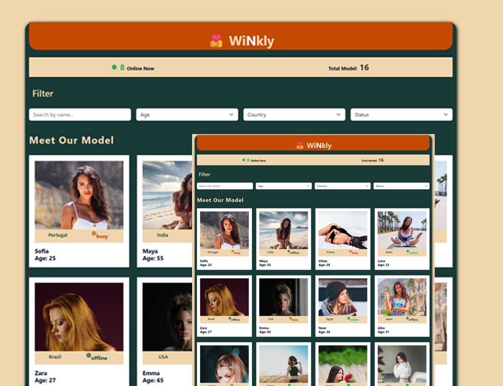

# 🧑‍🤝‍🧑 FindFriend – Model Explorer

**FindFriend** (WiNkly) is a responsive, filterable React-based model directory
where users can explore profiles, check availability status,
and refine results based on **name**, **age range**, **country**,
and **status** (online/busy/offline).

Built with a modular component architecture and enhanced with Bootstrap styling.



---

## 🚀 Features

- 🔍 **Live Filtering** by:

  - Name (search box)
  - Age range (dropdown)
  - Country (with count)
  - Online Status: Online, Busy, Offline

- 📊 **Stats Bar** showing:

  - Total models available
  - Live count of online models

- 🧩 **Component-Based Structure** using React:

  - `FilterBar`, `ModelCard`, `StatsBar`, `ModelCategory`, etc.

- 🎨 **Modern UI**:
  - Fully responsive layout
  - Styled using Bootstrap + SCSS

---

## 📁 Folder Structure

FindFriend/ ├── public/ ├── src/ │ ├── assets/ # Images & visuals │ ├── components/ # Reusable React components │ │ ├── FilterBar.jsx │ │ ├── Header.jsx │ │ ├── ModelCard.jsx │ │ ├── ModelCategory.jsx │ │ └── StatsBar.jsx │ ├── data/ │ │ └── modelData.js # Static data for models │ ├── scss/ # Custom styles │ ├── App.jsx # Main app logic │ └── main.jsx # Entry point

---

## 🛠 Tech Stack

- **React.js**
- **Bootstrap 5**
- **SCSS**
- **Vite** (for fast build and dev)

---

## 🌐 Live Demo

> [View Live](https://dev-hemraj.github.io/findfriend/)

---

## 📦 Getting Started

### 1. Clone the repository

```bash
git clone https://github.com/dev-hemraj/findfriend.git
cd findfriend
```

---

## 🙌 Credits

Designed and developed by **Hemraj Bhatt**  
Feel free to fork, contribute, or use the project for learning and showcase.

---

## 🙌 Acknowledgements

- Model images used in this project are sourced from [Unsplash](https://unsplash.com/).  
  Special thanks to all the amazing photographers.

- Thanks to [ChatGPT by OpenAI](https://openai.com/chatgpt) for assistance in crafting and polishing this README.
